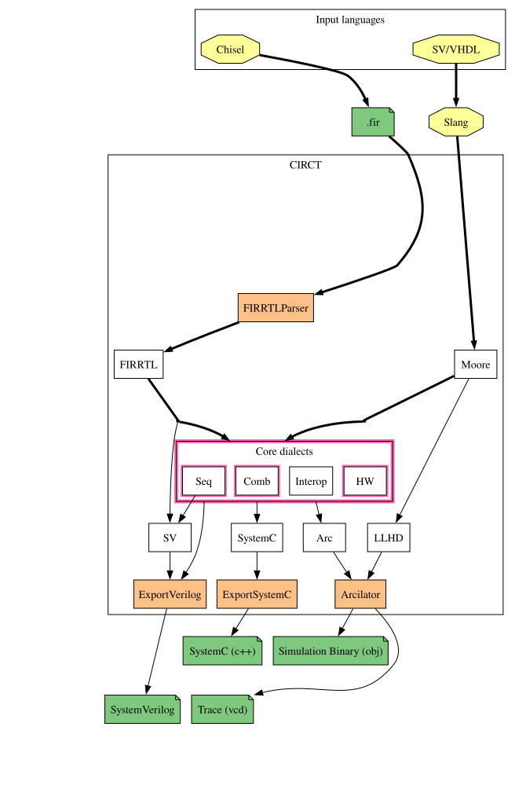

# RTL timing for Atlas

Per-operation engine timing is computed from the Atlas RTL rather than typed into the compiler. A C++ exporter turns CIRCT HW IR into JSON, a Python simulator executes each engine's control logic cycle by cycle, and the resulting facts (`merlin.op_timing.v1`) drive scheduling, delay insertion and final verification in the compiler. The compiler supplies instruction structure; the facts supply the numbers.



## Pipeline

1. **Retain.** Lower the selected FIRRTL to HW IR with `firtool`.
2. **Extract.** `tools/extract-rtl-timing.py` exports the engine modules and evaluates the per-engine specs in `tools/rtl_extract/targets/atlas/`. Ports come from bundle naming, memory response latency is measured on the memory module, and command codes come from ISA words through the RTL decoder. See the [extractor reference](../../tools/rtl_extract/README.md).
3. **Select.** `--select-atlas-rtl-evidence` loads the facts file by SHA-256 and records the selection on the module. The `atlas.op_timing.serialized.v1` resolver then answers footprint queries for scheduling, delay insertion, `--verify-atlas-rtl-timing`, `atlas-emit` and the LLVM handoff.
4. **Check.** The extractor tests, a compiler cross-check and end-to-end simulations validate the facts; see [verification](verification.md).

Without a selection the compiler's built-in rules apply and behavior is unchanged.

## Reproduce

Lower the selected FIRRTL with the options of `tools/retain-ee290-hw-ir.py`, adding `-O=debug --preserve-values=named` and dropping `--repl-seq-mem` and `--repl-seq-mem-file`. The default lowering removes dead ports and wire names and turns on-chip SRAMs into external blackboxes; the extractor would report such records as unresolved. With inline memories, VMEM and MREG appear as `seq.firmem 1, 1, undefined`.

Build the exporter and extract (details in the [extractor reference](../../tools/rtl_extract/README.md#build-and-run)):

```sh
python3 tools/extract-rtl-timing.py --hw-ir ee290.debug.hw.mlir \
  --exporter build/rtl-extract/exporter/hw_ir_export --target atlas --output facts.json
```

Select the facts in the compiler, then schedule and verify:

```sh
atlas-opt prog.mlir \
  --select-atlas-rtl-evidence="op-timing=facts.json op-timing-sha256=$(sha256sum facts.json | cut -d' ' -f1) dma=wait" \
  --schedule-atlas-stream --verify-atlas-rtl-timing -o final.mlir
atlas-emit --rtl-timing-json final.mlir > resolved.json
```

`--insert-atlas-delays` replaces `--schedule-atlas-stream` for delay insertion only. `dma=wait` is optional and enables DMA (see below). `atlas-emit --rtl-timing-json` fails without output if the stream is unsafe, uses an unsupported operation, or lacks a valid selection; it reports the resolved footprints of the final instruction stream.

## Scope and assumptions

- Each record describes one operation issued to an idle engine. Overlap between operations, control flow and DMA lifetimes follow the compiler's conservative serialization.
- On-chip VMEM and MREG reads take one cycle: the IR declares them `seq.firmem 1, 1`, and the LSU is always granted ahead of DMA and TileLink. Records report this as `scratchpad_read_latency`.
- External memory and DMA completion are not modeled; they are variable and governed by `dma.wait`.
- Registers without a reset value are accepted only when listed in a spec's `unreset`; every control output must still be known at every age.
- Ages are absolute from the first cycle after reset and flush. Hold ends are inclusive: a last occupied age of 34 means the next VLS issues at age 35.
- The compiler supports VLS, XLU, all VPU operations, MXU commands on both units (weight and accumulator push, matmul with or without accumulation, FP8/BF16 pop), scalar `lw`/`seld`/`sw`, `addi`/`lui`/`delay`/`ecall`/marker, and DMA under `dma=wait`.
- Each MXU command holds both MXUs and the VPU, XLU and VLS paths through its last event, so MXU work is not overlapped. A matmul keeps its weight slot until its last accumulator write, since weight reads are not extracted.
- Branches, loops and joins are accepted when every engine is idle and no DMA is pending at each block boundary; each block is verified from an idle state with register values merged over all paths. Branches read their registers at issue and a taken branch executes only its delay slot (ADDI or LUI). Addresses that change between loop iterations are unknown at the loop header and rejected. `--rtl-timing-json` gives each instruction's block and block-relative issue cycle, and each block's successors and earliest successor issue.

### DMA

A DMA launch captures its scalar operands and the global DRAM base, so scalar registers and the base (set synchronously by `dma_config`) may be reused immediately. The transfer's VMEM and DRAM effects stay in flight until a `dma.wait` on the same channel. Under `dma=wait` the compiler allows one pending transfer; all VMEM accesses are excluded while it is pending, and a new launch, completion marker or halt requires every transfer to have been waited. Empty, wrong-channel and stale waits are rejected, and a delay cannot replace a wait. Issue coordinates across a wait are lower bounds; the resolved export reports wait-relative issue epochs and marks completion ages unknown.

## Results

Computed from the debug lowering of the selected FIRRTL; all equal the compiler's built-in rules.

| Operation | Reads | Writes | Next issue / free |
| --- | --- | --- | --- |
| `vload` / `vstore` | 1-32 | 3-34 | 35 |
| `vtrpose.xlu` | 1-32 | 34-65 | 66 |
| VPU elementwise (incl. `vmul.bf16`) | 0-63 | 2-65 | 65 |
| VPU row sum / row max, min | 0-31 | 7-38 / 2-33 | 38 / 33 |
| VPU column reductions | 0-127 | 66-129 | 129 |
| VPU pack / unpack | 0-63 / 0-31 | 3-65 (step 2) / 3-66 | 65 / 66 |
| VPU immediate pair / single | - | 1-64 / 1-32 | 64 / 32 |
| MXU0 / MXU1 matmul | 0-31 | accumulator 63-94 / 3-34 | - |
| Scalar load | 1 | 3 | 3 |

The extractor also reports MXU push/pop streams and busy windows, response-latency and operand variants, and an MXU1 accumulate boundary case.

## Not covered

- Same-MXU pipelining. The RTL allows, for example, MXU1 matmul→matmul 32 cycles apart, but some gaps (such as MXU0 matmul→weight push at 63) are not single-operation facts. Overlapping MXU commands needs pair results as a selected input and holds that may overlap within one MXU.
- Loop-varying addresses (per-state register enumeration is the next step) and engine work crossing block boundaries.
- Overlap rules in the compiler. The extractor's pair recipe (`tools/rtl_extract/pairs.py`) computes minimum issue gaps between operations, for example 1 for vload→vstore on distinct banks and exp→relu, but the compiler still serializes and system-level assertions are not yet executed by the sweep.
- Merlin consumption: a draft that merges `op_timing` blocks into Merlin's RTL facts is unreviewed, and no Phase 1/2 consumer reads them yet.
